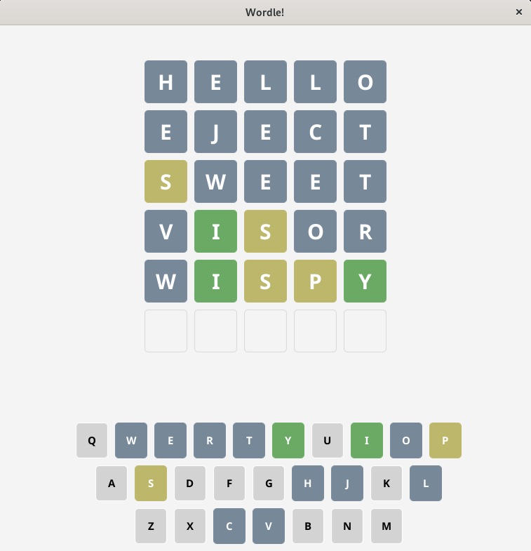
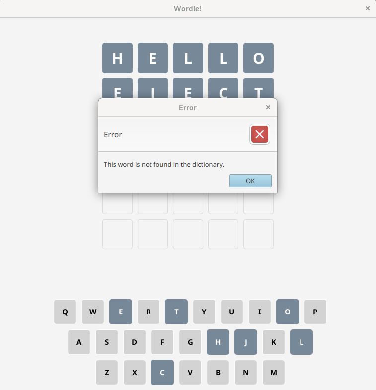
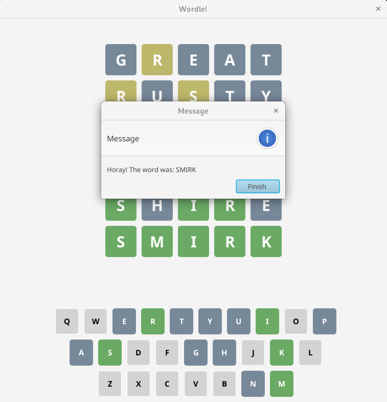
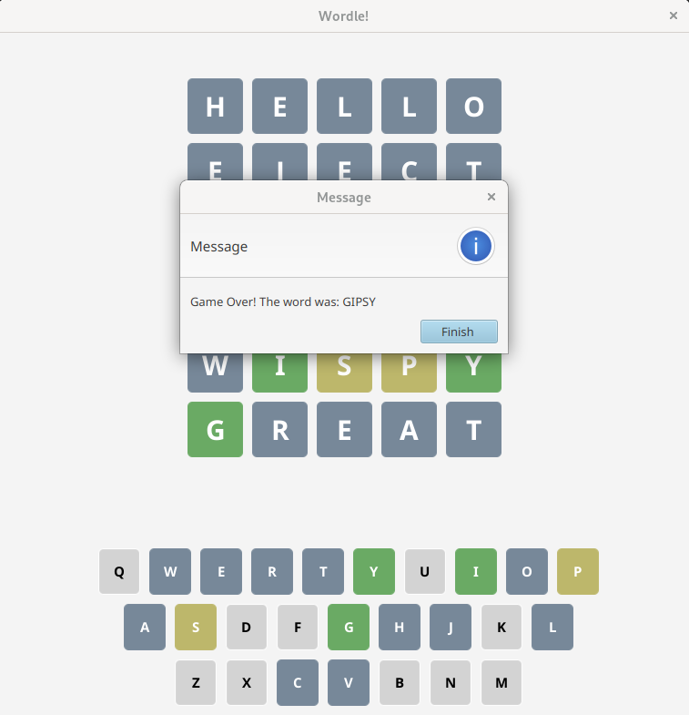

# Wordle

This is a Java application that simulates the internet game [Wordle](https://www.nytimes.com/games/wordle/index.html). 

# Implementation

This is implemented using Java and JavaFX. Also, this uses the MVC architectural pattern and uses the Observer/Observable behavioral design pattern.

# Gameplay

Now we will be going over some gameplay.

## Colors

The colors stay true to the original Wordle game. Gray means the letter is not found in the final world, yellow means the letter is in the word but it is not in the corrent position, and green means the letter is in the word and is in the correct position.

## Error Messages

This Wordle application uses an internal dictionary of ~2300 words, so it is bound to not have some words that may be guessed by the player. So, to ensure that a valid word is guessed, the player must guess a word from the dictionary. When a word that is not in the dictionary is guessed there will be an error message:

## Ending the Game

There are two different messages for when someone wins or looses the game. 

To play again, the player can restart the application. A new word to guess will be randomly chosen from the dictionary.